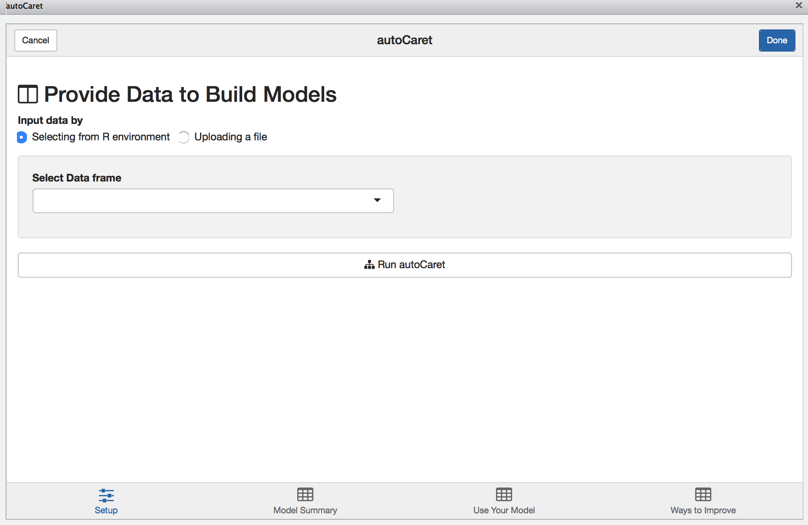
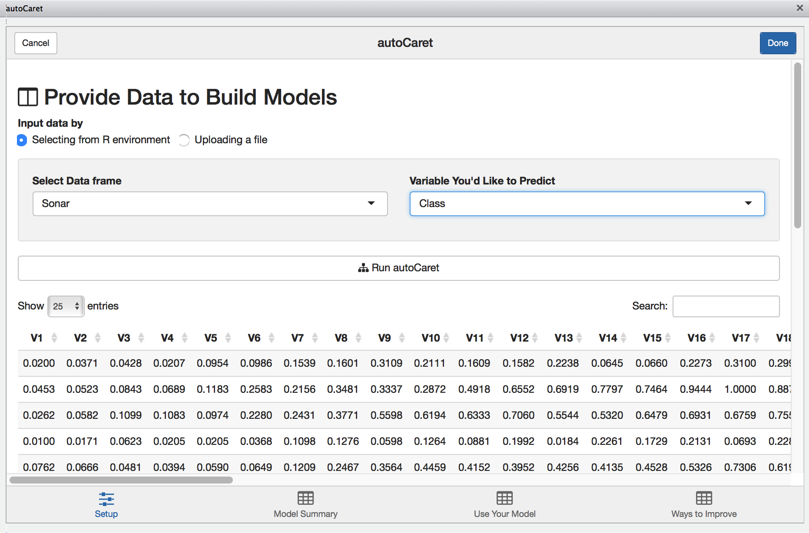
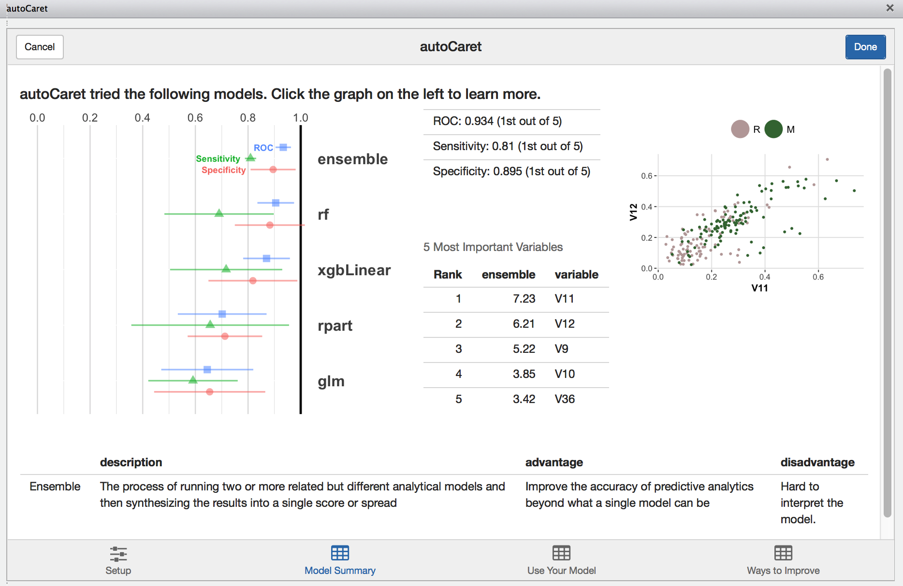
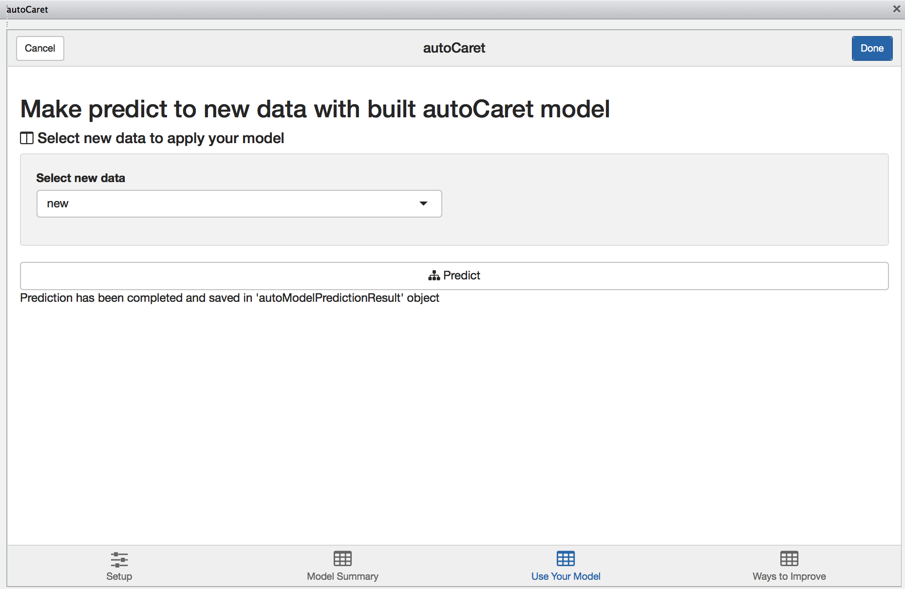
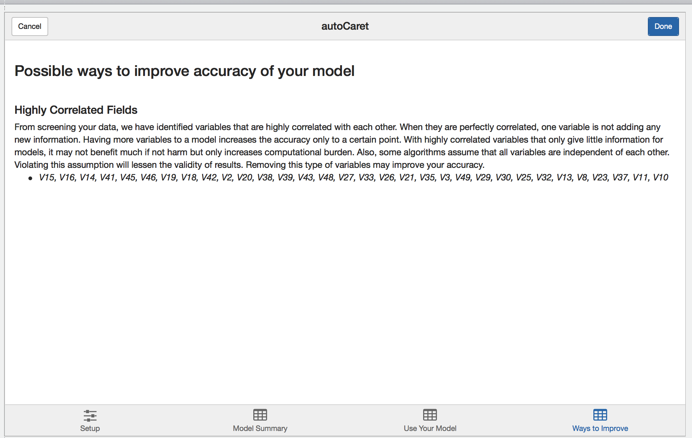

```{r echo = FALSE}

knitr::opts_chunk$set(collapse = TRUE, comment = "#>")

# Use vertical split by default in this Rmd document
knit_print.htmlwidget <- function(x, ...) {
  # Get the chunk height
  height <- knitr::opts_current$get("height")
  if (length(height) > 0 && height != FALSE)
    x$height <- height
  else
    x$height <- "450px"

  htmlwidgets:::knit_print.htmlwidget(x, ...)
}
```


Currently, the `autoCaret` package is not hosted on CRAN, but can be obtained from GitHub. To do so, first make sure you have [devtools](https://cran.r-project.org/web/packages/devtools/index.html) installed.

``` {r, eval=FALSE}
install.packages("devtools")
```

To install the first _preview release_ of `autoCaret` from GitHub:

```{r eval=FALSE}
devtools::install_github("gregce/autoCaret")
```

Once the `autoCaret` package is installed, you may access its functionality as you would any other package by calling:

``` {r, eval=FALSE}
library("autoCaret")
```

Additionally, the RStudio IDE includes integrated support for using autoCaret as an add-in. These features are available in the current [Release of RStudio](https://www.rstudio.com/products/rstudio/download/).

## Using `autoModel`

We begin by loading the `mlbench` package and some example data `Sonar` which is commonly used to binary classification problems. In this example, we will attempt to distinguish Mines (M) from Rocks (R) using binary classification with an initial dataset of where N=208 and P=60.  

As a general rule, when using `autoCaret::autoModel` defaults, datasets less than 100 mb should yield optimal performance and likely avoid extremely long run times & high memory requirements. 

```{r, eval=TRUE}
library(mlbench)
library(autoCaret)

# Load the data into Memory from the mlbench package
data("Sonar")

# Summarize Sonar's Size
dim(Sonar)

# Check out Variable Names
names(Sonar)
```


Having both the data loaded and having inspected it, we can now make use of the `autoCaret::autoModel()` function.

In this example, we'd like to try and distinguish Rocks (R) from Mines (R), so we will attempt to predict the `Class` variable in the Sonar dataframe.

Using it's defaults, `autoModel` has 2 arguments we need to specify: `df` and `y`.

`df` is the Dataframe that we'd like to use build a binary classification model, while `y` is our classification target or response variable. We can use a non-exported package function, `autoCaret:::checkBinaryTrait` to determine if our `y` variable is indeed binary. The `autoModel` functionality will perform this for us as well.


```{r, eval=TRUE, cache=TRUE, warning=FALSE, message=FALSE}
# Manually check that our intended y paramter is indeed binary
autoCaret:::checkBinaryTrait(Sonar$Class)

# Generate an autoCaret object using the autoModel function
mod <- autoCaret::autoModel(df = Sonar, y = Class, progressBar = FALSE)
```

<br> 

## Exploring an `autoCaret` object

In the example above, the returned object, `mod`, is an `autoCaret` object containing 16 objects. To confirm, we can run the below two commmands:

```{r eval=TRUE, warning=FALSE, message=FALSE}
# Check class of autoCaret object
class(mod)

# High level 
nrow(summary.default(mod))
```

Running the summary function on our model output displays a wealth of information about the contents of the object as well as the procedural steps taken during modeling. In our example, we observe:

 - that our initial dataset of 208 observation was split into a training and test set containing 167 and 41 observations 
 - Modeling took .64 minutes and entailed resampling our dataset 10 times 
 - We used the four default models to create an ensemble.
 - Using the ensemble model that was generated to predict on the test set yield predictions with 92% accuracy. 

```{r eval=TRUE, warning=FALSE, message=FALSE}
# Use the summary generic to store a summary of autoCaret object
overview <- summary(mod)
```

We can also access each of the object variables included in the above displayed summary output via the object itself.

```{r eval=TRUE, warning=FALSE, message=FALSE}
# Print the overview to the console
overview
```

<br>

## Predicting new data

So now that we have a sense of how successful our auto modeling approach was, we'd likely want to use the model, `mod`, we built previously to make predictions on new data we receive. 

Because this is an illustrative example, we'lll take a shortcut by just resampling the same data that we used to train on. The main point here is that you can simply pass your `autoCaret` model object, `mod`, into the `predict()` function along with new observations to generate predictions. 

```{r eval=TRUE, warning=FALSE, message=FALSE}

#For the sake of example, simulate new data by resampling our original data frame
new <- Sonar[sample(1:nrow(Sonar), 50, replace=TRUE),]

#Make predicitons 
preds <- predict(mod, new)

#Print Predictions 
preds
```

How well did we do? Well a confusion matrix from the `caret` package can tell us!

- We only mispredicted one example, for overall accuracy of .98
- **Note:** we wouldn't expect this level of accuracy using real data given we resampled from our original training set. 

```{r eval=TRUE, warning=FALSE, message=FALSE}
## How well did we do?
caret::confusionMatrix(data = preds, reference = new$Class)
```

<br>

## Using the `autoCaret` add-in

As an alternative option to the CLI, we provide an intuitive GUI in the form an [RStudio Addin](https://rstudio.github.io/rstudioaddins/).

The add-in may be accessed in two ways:

- Via the Addin menu following loading `autoCaret` via `library(autoCaret)` in [a recent release of Rstudio]( https://www.rstudio.com/products/rstudio/download/)
- By running the following non-exported function autoCaret:::autoCaretUI().

### Setup Screen

When launched, you'll be presented with the following screen. 



From here you may either:

- Upload a file containing your dataset
- Select the dataset you wish to model from your local `R` environment

**Note:** There will be nothing available to list if you have yet to load a `data.frame` in your local Global environment. 

To illustrate the GUI's use, let's use the same `Sonar` dataset from the above examples:



With the Sonar data.frame selected, we'll be presented with a preview of our data to visually inspect. Once we select the appropriate variable to predict, clicking `Run autoCaret` will launch the underlying process.

When modeling completes, the other tabs in the Addin are enabled and you may select them to view their contents. 

### Model Summary

The model summary screen provides an interactive way for you to review the resultant model object created when running `autoCaret`.



Clicking on the left hand side results visualization provides a layer of interactivity. This is a useful for  comparing the results of various models tried during the training phase and for gaining a better intuitive sense of the strengths and weaknesses of your models. 

### Predicting new data

Like in the section above, we use the `new` data.frame to simulate predictions. 

```{r eval=TRUE, warning=FALSE, message=FALSE}
#For the sake of example, simulate new data by resampling our original data frame
new <- Sonar[sample(1:nrow(Sonar), 50, replace=TRUE),]
```

Having it pre-exist in our Global Environment, we can select it from dropbown on the `Use your model` tab. Once we compute predictions, they will be saved in our Environment and named _autoModelPredictionResult_. 



### Learning more

Finally, during the modelling process, `autoCaret` runs a variety of diagnostics that help validate the underlying distribution and features of your data prior to pre-processing. Depending on what we find, we surface these as qualitative suggestions on the `learning more tab`. Feel free to review and incorporate these suggestions in the data cleaning step as you build <a href="https://en.wikipedia.org/wiki/Binary_classification" target="_top">binary classifiers</a> with `autoCaret`. 




