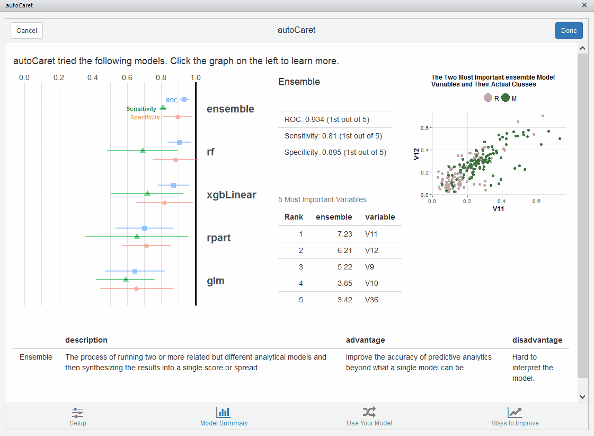
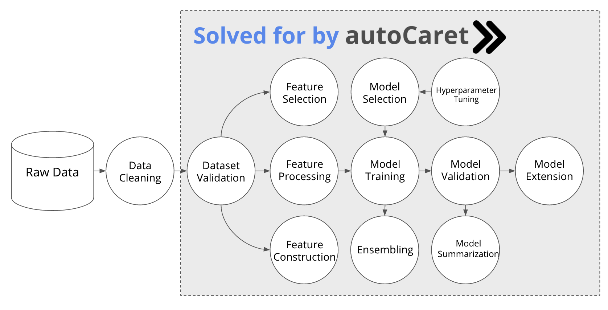

```{r echo = FALSE}
knitr::opts_chunk$set(collapse = TRUE, comment = "#>")

# Use vertical split by default in this Rmd document
knit_print.htmlwidget <- function(x, ...) {
  # Get the chunk height
  height <- knitr::opts_current$get("height")
  if (length(height) > 0 && height != FALSE)
    x$height <- height
  else
    x$height <- "450px"

  htmlwidgets:::knit_print.htmlwidget(x, ...)
}
```



## Overview

<a href="http://github.com/gregce/autoCaret/" target="_top">autoCaret</a>
 is a `R` package for helping business analysts and other enthusiasts understand how to begin building predictive models in `R` via automation. View our <a href="slides/autoCaret_pres.html" target="_top">intro presentation</a>!

It leverages and wraps underlying features and functionality provided by both the <a href="http://caret.r-forge.r-project.org/" target="_top">caret</a>, (short for **C**lassification **A**nd **RE**gression **T**raining)
and  <a href="https://cran.rstudio.com/web/packages/caretEnsemble/index.html" target="_top">caretEnsemble</a> `R` packages in an effort to provide a simple programmatic interface for analysts who would like to begin working on <a href="https://en.wikipedia.org/wiki/Binary_classification" target="_top">binary classification problems</a> . 

Also included in the package is also an intuitive graphical interface - in the form of an <a href="https://rstudio.github.io/rstudioaddins/#overview" target="_top">RStudio Add-In</a> - that allows for an easy introduction into the package's main functionality - producing an ensemble model via `autocaret::automodel()` - in order to help speed the learning and development process.

<br>

## Why `autoCaret`? 

### 1. It's easy to believe that machine learning is hard
We fundamentally believe that the _best ideas_ and _concepts_ in machine learning are simple but that current literature and accessibility to "getting started" with machine learning sometimes puts walls up against these ideas. 

We think:

- People should be empowered to use machine learning via simple tools
- These tools should allow for a linear path enabling their users to graduate into using the underlying language(s) used to make them
- There needs to be a focus on an analyst's understanding about what is happening, said differently: robust explanation/summarization about the modeling process is best

<br>

### 2. Making machine learning easier is important

Machine learning is a field that will only continue to pervade modern life. We think that additional tools need to be built to get analysts, who might not have much experience using `R` or other programming languages, engaged and excited about using machine learning in their day to day. 

Why is this so important?

- Machine learning can allow for automated decision making - freeing up human time to work on tasks requiring creativity
- Machine learning methods add to current heuristic or rule based approaches, most fundamentally, they enable the ability to "learn" without being explicitly programmed
- It's pretty clear that  <a href=" http://www.gartner.com/smarterwithgartner/what-we-can-do-with-machine-learning/" target="_top">Machine learning is revolutionizing every industry</a> - analysts and others have a real need to understand what is going on "behind the curtain" since most use it daily without even noticing.

<br> 

### 3. It's feasible to make machine learning even easier!

While `R` tools like `caret` have brought us a long way in the effort to standardize many of the commonly repeated parts of the process required for building predictive models, there is no reason we can't further streamline this process. 

Python tools like <a href="https://github.com/rhiever/tpot" target="_top">TpoT</a> have attempted to do this using genetic programming. Additionally there are a number of proprietary tools built by companies like <a href="https://bigml.com/" target="_top">BigMl</a> and <a href="https://www.datarobot.com/" target="_top">DataRobot</a> that also seek to automate machine learning tasks.

The `autoCaret` package intends to take an analagous but simpler approach:

- We have an initial focus on binary classification
- We expose a minimal set of functions to the user and allow the objects returned to be interacted with <a href="https://stat.ethz.ch/R-manual/R-devel/library/base/html/InternalMethods.html" target="_top">internal generics</a>  like `summary()` and `predict()`
- We make available a dead simple GUI for those who'd prefer to use one over the command line (at first, at least, we hope)
- We're open source and on <a href="http://github.com/gregce/autoCaret/" target="_top">GitHub</a>. Send a <a href="https://github.com/gregce/autoCaret/pulls" target="_top">pull request</a>!

<br>

## Where does `autoCaret` fit?
Both sourcing raw data and cleaning it are the responsibility of the end user. Otherwise, many of the most tedious parts of the predictive model process are covered by `autoCaret`! Be sure to see the <a href="https://github.com/gregce/autoCaret/blob/master/vignettes/autoCaret.Rmd" target="_top">getting started guide</a> included with the package or explore other examples shown on this page.



There are too many potential possibilities for a `R` package like `autoCaret` to be able to provide functionality that would provide acceptable performance or even begin to be able to automate the data cleaning process. There are, however; a great wealth of tools that do help and should be explored -- the github page <a href=" https://github.com/rstudio/RStartHere" target="_top">RStartHere</a> is a great place to get begin getting acquainted!


