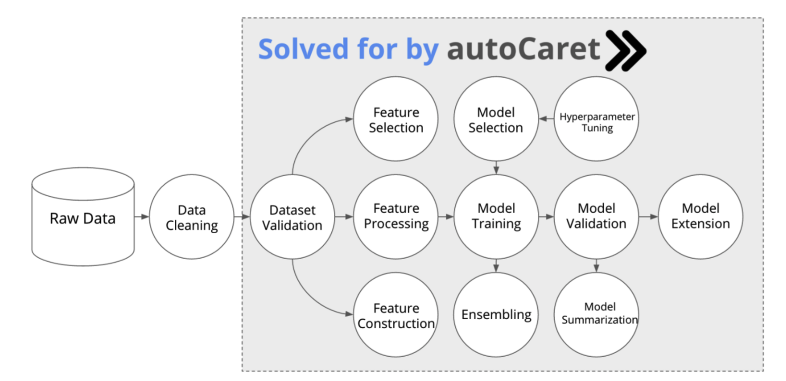
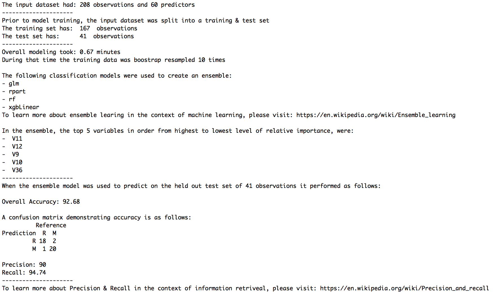

```{r setup, include=FALSE}
options(htmltools.dir.version = FALSE)
```

class: left

# Meet Tom. Tom is a data analyst.


### Tom’s skills:
1. SQL
2. Regex
3. BI tools like Tableau
4. Novice R programming

---

class: left

# Meet Bob. Bob is a data scientist


### Bob’s skills:
1. Machine learning
2. Advanced Stats
3. Experimentation
4. Expert R programming

---

# Tom's boss John wants Tom to be like Bob


---

class: left

# But machine learning is hard!


### Things to learn:
1. More `R`
2. Validation & splitting
3. Pre-processing
4. Feature Selection
5. Model Training
6. Model selection
7. Ensembling
8. Validation 
9. Model Extension, etc

---

class: left

# Enter `autoCaret`!


### What is it?
- An `R` package for data analysts
- Automates training binary classifiers
- Has an easy to GUI via an R Studio Add-in
- Wraps the `caret` and `caretEnsemble` packages
- Allows the analyst to learn in the language they will progress into

---

class: left

# autoCaret handles much of the ML tedium



---

# Tom can train a full model in 1 line of `R`

```{r message=FALSE, eval=FALSE, warnings=FALSE, message=FALSE, cache=TRUE, comment='#'}
library(autoCaret)
library(mlbench)
data(Sonar)

mod <- autoCaret::autoModel(Sonar, Class, progressBar = FALSE)
```

---

# It also provides very useful output!

```{r set-options, echo=FALSE, cache=FALSE}
options(width = 200)
```

```{r warnings=FALSE, eval =FALSE, cache=TRUE, comment='#'}
summary(mod)
```




---

class: left

# autoCaret helps make Tom more like Bob


---

class: center, middle

# Thanks!

autoCaret is available on [**github**](https://github.com/gregce/autoCaret).

More info on the project, the package and its features can be found at [**autocaret.info**](http://autocaret.info).

Slides created via the R package [**xaringan**](https://github.com/yihui/xaringan) using  [R Markdown](https://rmarkdown.rstudio.com).
