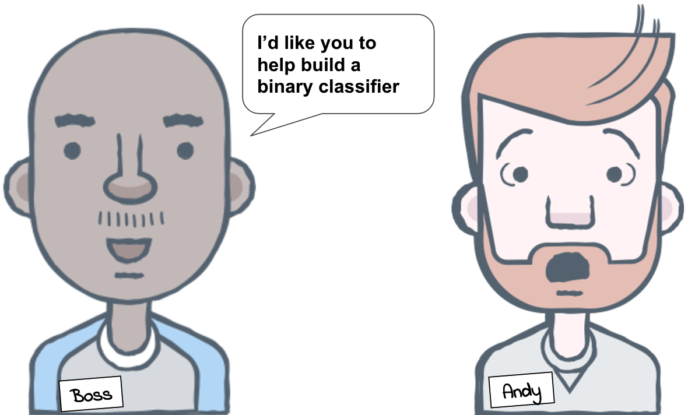
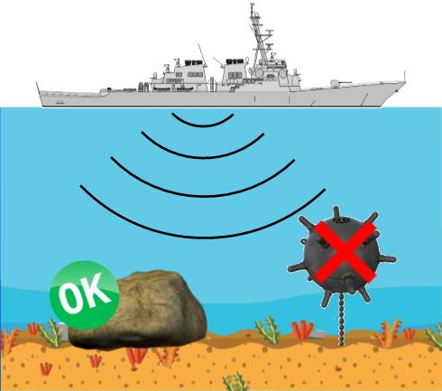
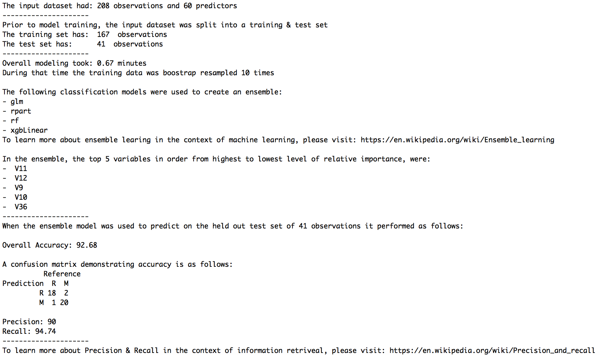
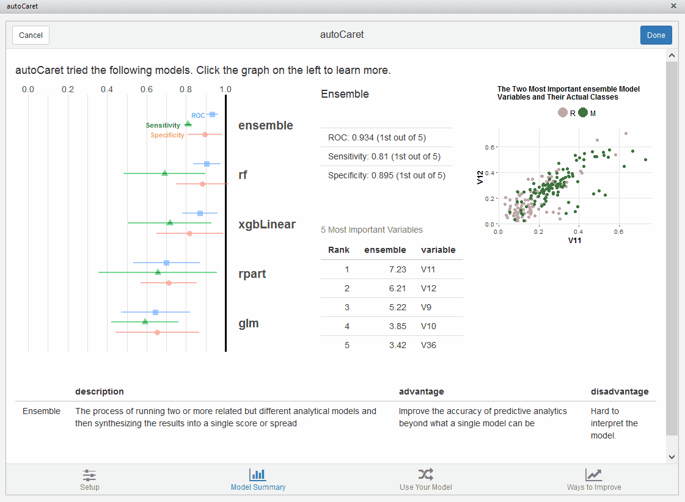
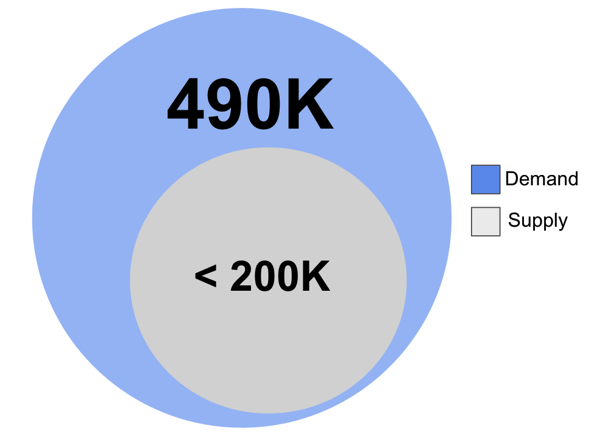
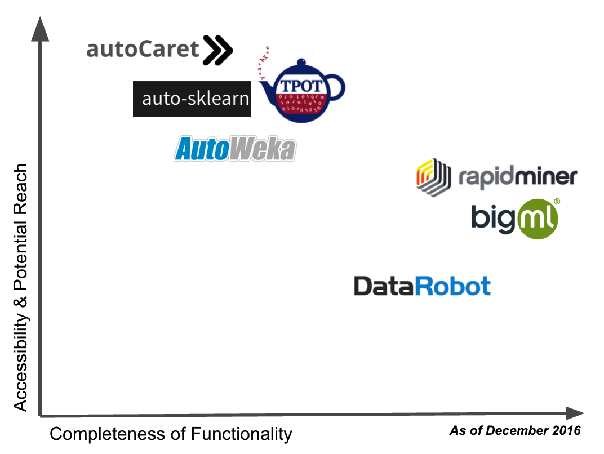

```{r setup, include=FALSE}
options(htmltools.dir.version = FALSE)
```

class: middle, center

# Introduction

---

class: left

# Meet Andy. Andy is a data analyst.


### Andy’s skills:
1. SQL
2. Regex
3. BI tools like Tableau
4. Novice R programming

---

class: left

# Meet Scott. Scott is a data scientist


### Scott’s skills:
1. Machine learning
2. Advanced Stats
3. Experimentation
4. Expert R programming

---

# Analyst Andy's boss wants him to be more like Data Scientist Scott



---

# Specifically he would like Andy to build a model to detect Rocks vs. Mines



---

class: left

# But machine learning is hard!


### Analyst Andy has to learn:
1. More `R`
2. Validation & splitting
3. Pre-processing
4. Feature Selection
5. Model Training
6. Model selection
7. Ensembling
8. Validation 
9. Model Extension, etc

---

class: left

# Enter `autoCaret`!


### What is it?
- An `R` package for data analysts
- Automates training binary classifiers
- Has an easy to GUI via an R Studio Add-in
- Wraps the `caret` and `caretEnsemble` packages
- Allows the analyst to learn in the language they will progress into

---

class: left

# autoCaret helps Andy adapt his skills


---

# Andy can train a full model in 1 line of `R`

```{r message=FALSE, eval=FALSE, warnings=FALSE, message=FALSE, cache=TRUE, comment='#'}
library(autoCaret)
library(mlbench)
data(Sonar)

mod <- autoCaret::autoModel(Sonar, Class, progressBar = FALSE)
```

---

# Andy also gets very useful information about what happened!

```{r warnings=FALSE, eval =FALSE, cache=TRUE, comment='#'}
summary(mod)
```




---

# A GUI allows him to further compare and explore his models

```{r warnings=FALSE, eval =FALSE, cache=TRUE, comment='#'}
autoCaret:::autoCaretUI()
```



---

class: left

# autoCaret helps make Andy be more like Scott


---

class: middle, center

# More Details

---

class: center


# `autoCaret` helps meet the 2018 Data Scientist talent gap



Source: [**McKinsey, 2016**](http://www.mckinsey.com/business-functions/digital-mckinsey/our-insights/big-data-the-next-frontier-for-innovation) 

---

class: center

# `autoCaret` has competition but competes in both accessibility & reach!



---

class: left

# `autoCaret` does have it's share of advantages!


### Specifically, `autoCaret`:
- Is free and open software with source avaialble on [github](https://github.com/gregce/autoCaret)
- Is accessible to `R` users first and foremost, a large and growing community!
- It joins an extremely strong and vibrant package ecosystem
- It builds on top of two state of the art ML libraries, `caret` and `caretEnsemble` that are well supported
- Compared to some of it's competitors, it has more useful documentation and a simpler interface
- Oh, did we mention? It's free!

---

class: left

# What might the future hold for `autoCaret`?


- `autoCaret` will continue it's development on [github](https://github.com/gregce/autoCaret)
- Will focus on adding regression capabilities and then look towards unsupervised techniques
- We'll attempt to document and surface "reason codes" to allow for clearer exposition of decision making
- We will likely reach out and partner with Max Kuhn and Zach Mayer (creators of caret and caretEnsemble respectively)
- A list of to-do's and open issues is available [here]()

---

class: center, middle

# Thanks!

autoCaret is available on [**github**](https://github.com/gregce/autoCaret).

More info on the project, the package and its features can be found at [**autocaret.info**](http://autocaret.info).

Slides created via the R package [**xaringan**](https://github.com/yihui/xaringan) using  [R Markdown](https://rmarkdown.rstudio.com).
